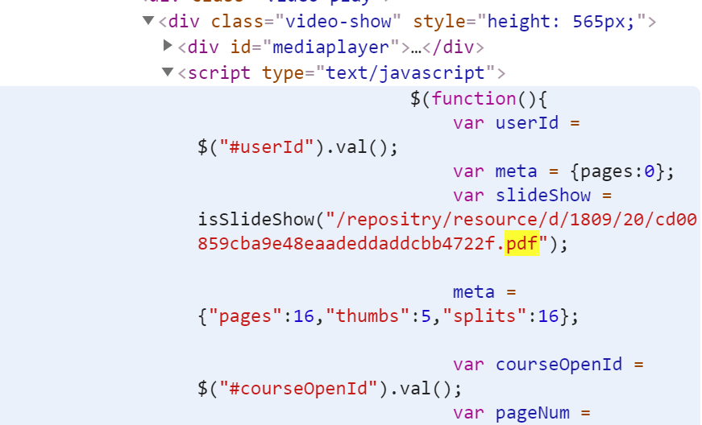
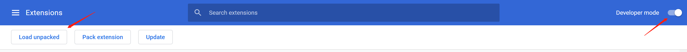
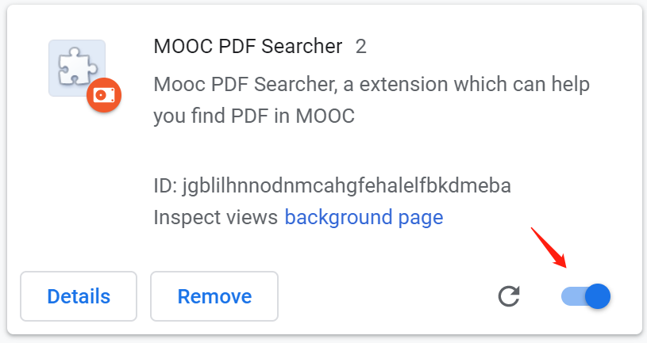
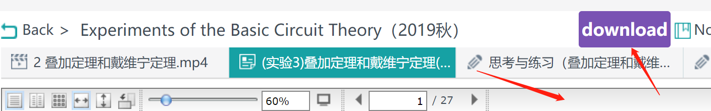

### MOOC PDF Searcher

#### 1. 前言

要期末了，有些同学想要下载慕课上的PDF呀，但是网页却不给下载，但是其实在网页的链接上是有这个PDF链接的，如下

所以可以利用这个链接进行下载，这也是该项目的原理

#### 2.使用方法

- 下载该[文档文件](https://github.com/Edgar-better/MOOC_PDF_Searcher/archive/master.zip)
 
- 进入[谷歌扩展中心]( [chrome://extensions/](chrome://extensions/) )

 

- 打开开发者选项，加载文件包

   

- 启动扩展

   

- 双击击PDF上面的 bar，可出现 *download* 按钮，点击即可下载

 

#### 3.说明

部分PDF可能出现不能下载的现象，原因应该是该网页中实际上不存在该*链接*，这样的话，只能慢慢看了，如果有**bugs**，可以联系 2639296545@qq.com，或者在GitHub提交issue

